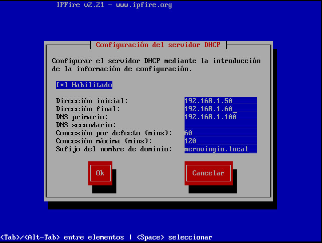
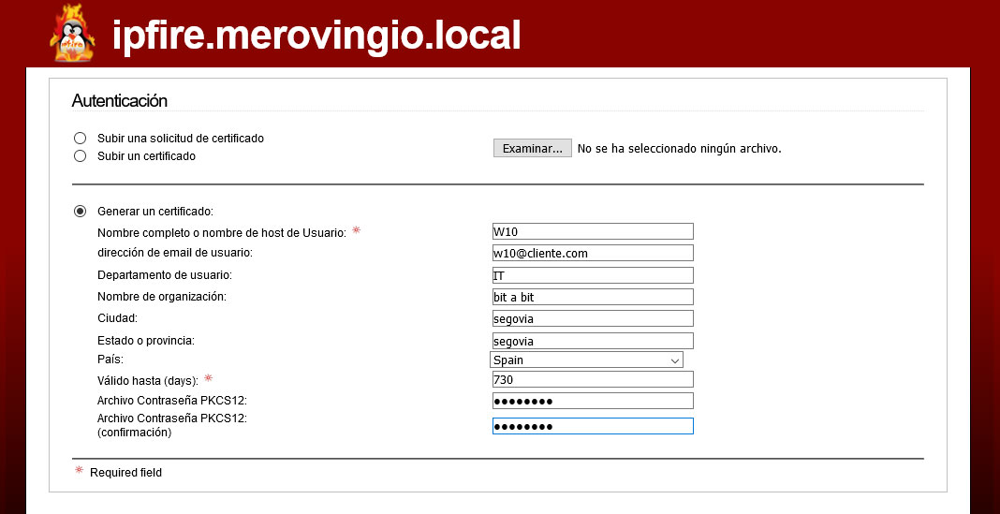
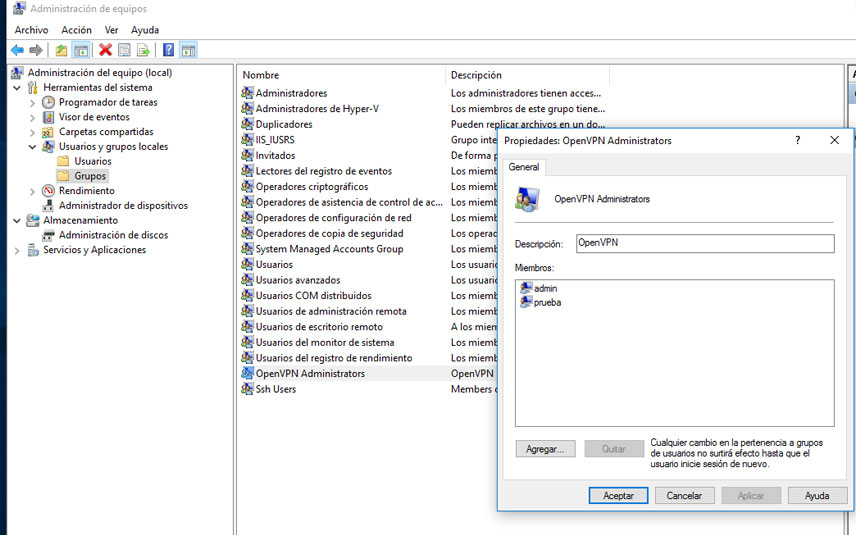

# Insatalación y configuración de IPFire

Este artículo es el primero de una serie en los que instalaremos y configuraremo un UTM en general y montaremos una VPN con OpenVPN en particular.
Las pruebas e instalación de máquinas las realizaremos sobre VMWare y nuestra red estará compuesta por las siguientes máquinas:

- IPFire (UTM red interna)
- Windows Server 2016 (Controlador de dominio / red interna)
- Windows 10 (cliente / red interna)
- Windows 7 (cliente / red externa)

Debemos prestar especial atención en la configuración de las tarjetas de red de cada máquina tanto en VMWare como en el propio sistema ya que podemos acabar tirándonos de los pelos por una mala configuración. Si no tienes unos conocimientos mínimos sobre redes o los tienes algo oxidados mi consejo es que antes de nada te pongas al día. Términos como NAT, routing, dhcp, dns o Firewall debes tenerlos claros para que todo fluya y no acabes maldiciendo sobre TCP ;-)

### ¿Qué es IPFire?

IPFire es una distribución Linux orientada a la gestión unificada de amenazas o UTM (Unified Threat Management), esto nos ayuda a proteger nuestra red corporativa de ataques desde el exterior así como a cumplir las políticas que se establezcan.
IPFire es un sistema ligero y que utiliza pocos recursos, podemos empezar a funcionar con él con tan sólo 128MB de RAM aunque si utilizamos todas las opciones y tenemos muchos equipos conectados deberemos ampliar la capacidad de procesamiento y memoria del sistema.
<b>Las características</b> por defecto que incluye IPFire son las siguientes:

-     Servidor Proxy.
-     Sistema de detección de intrusos en una red o equipo.
-     VPN a través de IPsec y OpenVPN.
-     Servidor DHCP.
-     Caché de nombres de dominio.
-     Servidor horario.
-     Wake-on-Lan.
-     Servidor DDNS.
-     QoS.
-     Completo Log de todos los sucesos que ocurren en el sistema.

IPFire permite la instalación de software adicional a través de plugins, algunas funcionalidades extra que podemos incorporarle es por ejemplo un servidor de archivos en red, servidor de impresión, Asterisk, TeamSpeak, servidor de correo, servidor de medios DLNA y otros plugins disponibles en la página web oficial.

IPFire también es compatible con arquitecturas ARM, es decir, es compatible con Raspberry PI o equipos similares. IPFire se puede descargar desde su página web principal de forma totalmente gratuita.

Podemos descargarlo de manera gratuita desde su [página ofical.](https://www.ipfire.org/)

<small>
Referencias:

https://www.redeszone.net/ipfire/

https://latam.kaspersky.com/resource-center/definitions/utm
</small>

### Instalación de IPFire

Lo primero será [descargar](https://www.ipfire.org/) IPFire de su página oficial. En nuestro caso la imagen ISO x86_64


<b>Configuración de nuestra máquina virtual en VMWare para IPFire.</b>


Esta configuración es orientativa ya que se está haciendo para el laboratorio de pruebas, para un entorno de producción tendrás que considerar la cantidad de RAM o procesamiento que necesitas en función de la carga de trabajo que tenga tu red.

Las configuraciones de las tarjetas de red se realizan sobre la propia máquina pero hay que tener en cuenta cómo están configuradas en VMWare.
Puedes conocer más acerca del administrador y los distintos tipos de redes que podemos crear y utilizar en VMWare [aquí](https://windowserver.wordpress.com/2015/03/03/vmware-workstation-parte-3-el-administrador-de-redes/).
Dicho esto nuestra configuración de red en IPFire quedaría así:

- Adaptador 1 en modo Bridget (WAN Internet)
- Adaptador 2 en modo Host-only (LAN Interna)
- Adaptador 3 en modo Host-only (WLAN Wifi)


Arrancamos la máquina con la ISO cargada en el CD y seleccionamos la instalación


Seleccionamos idioma


Aceptamos la licencia


Nos pide formatear el disco creado para la máquina, confirmamos


Seleccionamos el sistema de archivos, por defecto ext4


Comienza la instalación y esperamos hasta que nos pida reiniciar


Elegimos el tipo de teclado y la zona horaria


Introducimos el nombre que queremos dar a la máquina y al dominio


Seguido nos pedirá que pongamos una contraseña para el usuario "root" que es el que utilizaremos para la linea de comandos, ssh, etc... y el password para el usuario "admin" que es el que se utilizará para la gestión de IPFire desde la interfaz web en el navegador


En la siguiente sección configuraremos las interfaces de red en función de nuestras necesidades y es en la que deberemos poner mayor atención y tener claro qué tarjeta de red vamos a utilizar en función de su objetivo.


Aunque con la opción GREEN + RED nos valdría para este post yo voy a instalar la opción 3 por que es posible que la utlice en próximos artículos.
La siguiente tabla muestra para qué es utilizada cada red

<table class="inline">
<tbody>
<tr class="row0">
<td class="col0"><strong><span style="color:red;">Red</span></strong></td>
<td class="col1">WAN</td>
<td class="col2">La que proporciona salida a internet o hacia el exterior</td>
</tr>
<tr class="row1">
<td class="col0"><strong><span style="color:green;">Green</span></strong></td>
<td class="col1"><abbr title="Local Area Network">LAN</abbr></td>
<td class="col2">Nuestra red privada o local</td>
</tr>
<tr class="row2">
<td class="col0"><strong><span style="color:orange;">Orange</span></strong></td>
<td class="col1">DMZ</td>
<td class="col2">Aquí se pondría la zona desmilitarizada si disponemos de ella</td>
</tr>
<tr class="row3">
<td class="col0"><strong><span style="color:blue;">Blue</span></strong></td>
<td class="col1">WLAN</td>
<td class="col2">Para la red wifi, separada de nuestra red local como por ejemplo la que utilizarían nuestros clientes</td>
</tr>
</tbody>
</table>


El siguiente paso es asignar a cada interfaz una de las tarjetas de red que creamos para la máquina en VMWare


Configuramos la red GREEN y le asignamos el "adaptador de red 2" que hemos creado. Podemos comprobar cuál es la tarjeta verificando su MAC desde las propiedades de la máquina, seleccionando el adaptador y clickando en "Advanced.."


Haremos lo mismo con el resto de redes


El siguiente paso es la asignación de IPs, máscaras y puerta de enlace (sí en singular, ya que la única interfaz con puerta de enlace es la "RED" que es la que nos da salida a internet)


Desde el editor de red de VMWare podemos ver el rango al que pertenece cada red que tengamos creada y en consecuencia asignar la IP a cada interfaz


En la interfaz RED vemos que podemos poner IP estática o que le sea asignada por DHCP. En nuestro caso le asignaremos una IP estática ya que, por ejemplo, cuando configuremos nuestra VPN haremos un mapeo de puertos en el router que apunte a esta dirección.


Una vez se configuren todas le daremos a "Hecho". <b>Nota: Aunque después de completar la instalación se pueden reasignar o modificar las IPs es preferible dedicarle un tiempo a estudiar nuestra red y sus necesidades antes de implementarlo, nos ahorrará algún que otro dolor de cabeza ;-)</b>


Lo siguiente a configurar son los DNS y la puerta de enlace, como ya comenté esto es sólo para la interfaz "RED"


El siguiente paso es opcional. Podemos habilitar DHCP en la interfaz "GREEN", yo la he habilitado como ejemplo.




<b>Los más observadores habrán notado que el DNS asignado es la IP que le dimos a la tarjeta "GREEN" y esto es así por que si por ejemplo le asignásemos los de google este no resovería nada...¿por qué?.. buena pregunta, por que como ya dije la única red que tiene conexión con el exterior es la "RED" , en los próximos artículos cuando configuremos OpenVPN lo veremos mejor e intentaré explicar algo sobre NAT, routing e iptables.</b>


En el siguiente artículo veremos la interfaz web de IPFire para su administración.

---

---

---

# Administración de IPFire

En este artículo vamos a ver las diferentes opciones que disponemos para la administración de IPFire. Lo primero que tenemos que tener claro son los diferentes tipos de red que hemos configurado y la utilización de sus interfaces.
Este es el esquema de red que vamos a utilizar en esta serie de artículos.


Para la administración de IPFire se van a utilizar las interfaces "RED" y "GREEN", obviamente esta tarea se puede llevar a cabo en la propia máquina física ;-).

## La interfaz "GREEN"

La interfaz "GREEN" es la que utilizaremos para la administración de IPFire de manera local, vía "https" y desde el navegador. Yo voy a utilizar Firefox pero podéis utilizar el que más os guste.
Para acceder debemos utilizar la ip que asignamos a "GREEN" y el puerto 444 que es el que IPFire establece por defecto (podemos asignar el que queramos).
La primera pantalla que nos aparece es una alerta de conexión no segura que tiene relación con los certificados, en este caso no hay que preocuparse ya que es nuestro sistema. Pinchamos en avanzado, entendemos los riesgos y queremos continuar y confirmamos la excepción de seguridad para este sitio.


Lo siguiente que nos solicita es el usuario y contraseña, recordemos que en la instalación de IPFire se nos solicitó asignar una contraseña para el usuario "root" y otra para el usuario "admin", pues bien, nos logueamos con "admin" y la contraseña que le dimos


Estamos dentro!!


Si navegamos por los distintos menús podemos ver las posivilidades que nos brinda IPFire, desde opciones de confiración de la red, sistema de estado y logs, implementación de servicios como OpenVPN que veremos en próximos artículos o la [actualización del sistema y la implementación de módulos.](http://systembackdoors.blogspot.com/2013/09/actualizacion-y-addons-para-ipfire.html)
Desde este panel de control podemos administrar y configurar la mayor parte de las opciones que nos da el sistema pero para otro tipo de configuraciones o modificaciones más avanzadas las tendremos que gestionar desde la propia máquina o vía ssh.

## La interfaz "RED"

La interfaz "RED" nos conecta con el exterior, es decir, la conexión que nos da nuestro ISP, nuestra línea MPLS, ADSL, Modem o el tipo de conexión que utilicemos para este fin. Esta interfaz la utilizaremos para una administración vía SSH y podremos accederla desde cualquier lugar con conexión a internet.
Desde la red "GREEN" también podemos acceder vía ssh pero sólo en local.

Ejemplo conexión en la propia máquina


La conexión ssh viene deshabilitada por defecto con lo que tendremos que habilitarla desde el menú "Sistema/Conexión SSH"


Agregamos una nueva regla al firewall (iptables)


En nuestro router tendremos que mapear el puerto 22 que es el que corresponde a ssh para que apunte a nuestro IPFire y así poder realizar las conexiones desde el exterior. En el siguiente artículo crearemos una VPN con OpenVPN y entraremos más en detalle sobre el mapeo de puertos, IP estáticas, no-ip y DNS dinámicos


Para probar la conexión ssh utilizaremos Putty


Aceptamos


Nos logueamos como "root"


En el próximo artículo crearemos una red VPN con OpenVPN en IPFire. Veremos la configuración tanto del servidor cómo de los clientes.

---

---

---

# VPN con OpenVPN en IPFire

### ¿Qué es una VPN?

Según [Wikipedia](https://es.wikipedia.org/wiki/Red_privada_virtual):

> "Una red privada virtual (RPV), en inglés: Virtual Private Network (VPN), es una tecnología de red de computadoras que permite una extensión segura de la red de área local (LAN) sobre una red pública o no controlada como Internet. Permite que la computadora en la red envíe y reciba datos sobre redes compartidas o públicas como si fuera una red privada con toda la funcionalidad, seguridad y políticas de gestión de una red privada. Esto se realiza estableciendo una conexión virtual punto a punto mediante el uso de conexiones dedicadas, cifrado o la combinación de ambos métodos."

Es decir, nos permite conectar equipos que no se encuentran físicamente en el mismo lugar utilizando una red pública como es internet y emulando una conexión de red local o privada, de ahí su nombre.
Usar una VPN nos brinda una capa extra en seguridad ocultando la ip de nuestro dispositivo y de privacidad (siempre que esté bien configurada) al cifrar las comunicaciones.
Utilizar una VPN nos permite navegar através de una Wifi pública de una manera segura ocultando nuestros datos de navegación, puede saltarse restricciones geográficas de determinados servicios como por ejemplo los de visionado de vídeos o la censura impuesta por algunos gobiernos a sus ciudadanos.
En el mundo empresarial las VPNs son utilizadas para interconectar sedes o permitir teletrabajar de forma segura estando conectados a la red privada de la empresa.
Si quieres conocer más sobre los tipos de VPN y sus protocolos echa un vistazo a [este artículo](http://rcg-comunicaciones.com/tipos-de-vpn-y-sus-protocolos/)

## ¿Qúe es OpenVPN?

OpenVPN es un sistema VPN del tipo cliente/servidor multiplataforma, compatible con sistemas Microsoft Windows, GNU/Linux, MacOS y con aplicaciones para iOS y Android. Es un sistema Open Source con licencia GPL aunque también dispone de versiones de pago.

### Configuración servidor OpenVPN en IPFire

Para la configuración de OpenVPN vamos a utilizar la interfaz del navegador, con lo que iniciamos sesión y en la pestaña servicios seleccionamos OpenVPN.
Como podemos observar el servicio está detenido y vamos a tener que añadir cierta información obligatoria para poder arrancarlo.


Lo primero que vamos a marcar (sino no nos dejará iniciar el servidor) es, en qué interfaz queremos tener activada nuestra VPN. Para ello deberemos marcar la casilla correspondiente, en nuestro caso la interfaz "RED". Cuando activamos una de estas casilla se habilitan de forma automática las reglas que permiten el tráfico en el Firewall.
El Firewall es otra herramienta del sistema que tendremos que tener muy en cuenta ya que nos puede pasar que esté todo configurado correctamente en OpenVPN y el Firewall lo esté bloqueando. El Firewall nativo en sistemas GNU/Linux es IPTables, si quieres conocer más (cosa muy recomendable) [sobre IPTables.](http://recursos.juncotic.com/cursos/iptables/iptables_v3.pdf)
El resto sólo he modificado lo que está marcado pero explicaré un poco que es cada cosa:

- <b>Nobre de host/IP para VPN local:</b> el nombre netbios o la IP de nuestro IPFire.
- <b>Protocolo:</b> Podemos elegir entre TCP o UDP. A grandes rasgos, TCP es un protocolo orientado a conexión (confiable) que verifica cada paquete que es enviado mientras que UDP no. [Aquí](https://vpnpick.com/es/utilizando-openvpn-con-tcp-vs-udp-conoce-la-diferencia/) puedes leer un artículo donde se explica cada protocolo y sus pros y contras en una VPN. Nosotros elegiremos el protocolo UDP.
- <b>Tamaño de MTU:</b> Es el tamaño máximo de cada paquete al ser enviado. Debemos asegurarnos que no sea necesaria la fragmentación. Cuanto más nos acerquemos al tamaño optimo sin fragmentación mejor. En [este artículo](https://norfipc.com/redes/como-ajustar-valor-mtu-elevar-rendimiento-navegacion-web.html) sobre MTU se explica cómo ajustar el valor. Por defecto dejaremos 1400.
- <b>Compresión LZO:</b> Comprime los datos que pasan por el tunel reduciendo el tráfico de red pero aumentando la utilización de CPU. Por razones de seguridad se recomienta que esté desactivado.
- <b>Subred de OpenVPN:</b> Es la subred virtual o de transporte de OpenVPN. Debemos asegurarnos que esta subred no sea utilizada por ninguna de las redes conectadas a IPFire.
- <b>Puerto de destino:</b> Es el puerto utilizado por el protocolo y el que se utiliza para la comunicación remota. Puede ser cambiado pero debemos asegurarnos que el que pongamos no esté siendo utilizado por otro servicio. Este el puerto que debemos utilizar en el router si necesitásemos realizar un mapeo.
- <b>Encripción = Cifrado:</b> Aquí elegiremos el tipo de cifrado para nuestro canal de comunicación. Aquí puedes [leer más](https://www.redeszone.net/2016/12/27/openvpn-2-4-soportara-aead-con-aes-gcm-por-que-esto-es-importante/?utm_source=related_posts&utm_medium=manual) sobre esto. Yo he elegido AES-GCM (256 bit) por ser el más seguro.
- <b>Static IP address pools:</b>Desde aquí podemos crear otras subredes diferentes a la que hemos creado por defecto (80.80.80.0/24), cuando generemos los certificados para los clientes veremos mejor su utilización.

  

- <b>Opciones avanzadas de servidor:</b>
  - <b>Opciones DHCP.</b> Aquí se pueden ajustar los parámetros DHCP extendidos, estos parámetros son utilizados principalmente por los clientes Windows.
    - <b>Dominio</b> El sufijo DNS se puede configurar con un nombre.
    - <b>DNS</b> Podemos añadir un servidor DNS.
    - <b>WINS</b> Establece el servidor primario WINS.
    - <b>Route push options</b> Esta opción permite añadir rutas adiccionales a otras subredes a parte de la predeterminada "GREEN". Lo que viene a ser NAT o routing entre redes.
- <b>Opciones varias:</b>
- <b>Client-To-Client</b> - Esta opción hace posible que los clientes de OpenVPN puedan comunicarse entre sí. Mediante el uso de diferentes subredes, se deben utilizar las "Opciones de empuje de ruta" mencionadas anteriormente para hacer que las diferentes subredes sean accesibles entre sí.
- <b>Redirect-Gateway def1</b> - Dirige todo el tráfico IP a través del cliente VPN (por ejemplo, navegador web).
- <b>Configuración adicional</b>- Ofrece la posibilidad de ampliar el servidor pero también la configuración del cliente con directivas individuales. Si se activa dos archivos de configuración más llamados server.conf.local y client.conf.local, que se encuentran bajo la ruta /var/ipfire/ovpn/scripts, serán leídos y escritos en el server.conf original y/o el respectivo client.ovpn.
- <b>mssfix</b>[max] - Se utiliza para paquetes TCP que se envían a través de un túnel UDP. La conexión TCP se entrega con el tamaño máximo del paquete en bytes. A menos que no se edite ningún otro valor en el archivo de configuración, mssfix utiliza el mismo valor que fragment.
- <b>fragment</b> - Fragmenta los paquetes UDP no cifrados que se enviarán a través del túnel hasta el tamaño máximo de bytes del paquete. La cabecera UDP no está incluida. Esta opción sólo funciona con túneles UDP. Para desactivar "fragment" el valor del campo debe estar vacío.
- <b>Max-Clients</b> - Limita el número de clientes con conexiones paralelas (por defecto 100) .
- <b>Keepalive</b> - Se usa para controlar el túnel y mantenerlo con ping y ping-restart vivo.

  ```
  Nota: Los ajustes de mssfix y fragment deben realizarse una sola vez y no modificarse ya que si la configuración no es igual en el servidor y el cliente la conexión fallará. Es decir que si por alguna razón después de tener funcionando los clientes tuviésemos que modificar estos parámetros tendríamos que generar de nuevo los clientes y volver a instalarlos. "mssfix" y "fragmento" sólo deben utilizarse con el protocolo UDP; el TCP sólo debe estar regulado por el tamaño de la MTU.
  ```

- <b>Opciones de archivo de registro</b>

  - <b>verb</b> - Define el nivel de depuración.
    La escala de valores va de 0 a 11. De esta manera, los diferentes procesos de la conexión OpenVPN son minuciosos y pueden ser utilizados para la depuración o la optimización.

    Habrá diferentes secuencias de la conexión OpenVPN registradas y se pueden utilizar para depurar u optimizar. El valor por defecto se establece en el nivel 3, lo que proporciona una buena visión general de la conexión (interfaz, enrutamiento, encriptación, etc.).

    Con un modo verbose de 6 no es posible un uso normal del servidor. Las Modalidades 6 y superiores están pensadas para propósitos de depuración.

- <b>Opciones Criptográficas</b>

  - <b>Hash algorithm</b> - El algoritmo hash (directiva -auth) definido aquí se utiliza para asegurar la integridad de los paquetes IP que pertenecen al canal de datos y que serán probados por la función de un llamado código de autenticación de mensajes Hash (HMAC). Esta autenticación sirve a la integridad de los datos y evita una manipulación de los mismos. Se recomienda utilizar SHA-256 o superior.

  - <b>HMAC tls-auth</b> - TLS-Authentication utiliza el mismo algoritmo configurado anteriormente, aunque de forma diferente. Mediante el uso de esta opción, una clave estática de 2048 bits es responsable de firmar cada paquete OpenVPN con una firma adicional basada en hash. Esta es una protección adicional para DoS o ataques de repetición, pero también puede ser útil contra errores de programación (por ejemplo, bufferoverflows) de las librerías criptográficas en nuestro caso en la librería OpenSSL.

  

- ###### Referencia 1: https://wiki.ipfire.org/configuration/services/openvpn/config/static_ip
- ###### Referencia 2: https://wiki.ipfire.org/configuration/services/openvpn/config/advanced_set

## Generación de claves y certificados

El primer paso en la construcción de una configuración de claves en OpenVPN es establecer una PKI (infraestructura de clave pública). La PKI consta de:

- un certificado independiente (también conocido como una clave pública) y la clave privada para el servidor y cada cliente, y
- un maestro de autoridad de certificación (CA) de certificado y la clave que se utiliza para firmar cada uno de los certificados de servidor y cliente.

OpenVPN admite autenticación bidireccional basada en certificados, lo que significa que el cliente debe autenticar el certificado del servidor y el servidor debe autenticar el certificado de los clientes antes de que se establezca la confianza mutua.
Tanto el servidor como el cliente se autenticarán primeramente verificando que el certificado presentado por el otro fue firmado por la autoridad de certificado patrón (CA). A continuación ambos extremos verificarán la información del encabezado de los certificados verificando el nombre común o el tipo de certificado presentado (cliente o servidor).
Este modelo de seguridad presenta las siguientes ventajas:

- El servidor sólo necesita su propio certificado/clave - no es necesario que conozca los certificados individuales de cada cliente que pueda conectarse.

- El servidor sólo aceptará a clientes cuyos certificados fueron firmados con el certificado principal (CA) de la entidad emisora cuya generación veremos más adelante. Y debido a que el servidor puede realizar esta comprobación de la firma sin necesidad de acceso a la clave privada de la entidad emisora de certificados, es posible que la clave de entidad emisora de certificados (la clave más sensible en toda la estructura PKI) resida en una máquina completamente diferente, incluso sin una conexión de red con los elementos de la VPN.

- Si una clave privada está en peligro, puede desactivarse añadiéndose a una CRL (lista de revocación de certificados). La CRL permite rechazar certificados comprometidos de forma individual sin necesidad de tener que regenerar o reconstruir toda la estructura de claves y certificados (PKI).

- El servidor puede gestionar derechos de acceso específicos para diferentes clientes basados en los campos del certificado presentado, tales como el nombre común.
  ###### Fuente: https://www.davantel.com/user/image/generacif3n-de-claves-en-openvpn.pdf

Dicho esto lo siguiente que haremos será generar los certificados y claves del servidor. Para ello damos a "Generar certificados root/host".


Esto nos lleva al siguiente apartado donde para poder generar los certificados y claves necesarias para operar con OpenVPN será necesario proporcionar unos datos espcíficos.


#### El parámetro Diffie-Hellman

A partir del Core 123 ya NO es posible crear claves Diffie-Hellman con una longitud de 1024 bits porque se consideran inseguras.

Es posible configurar la longitud del parámetro Diffie-Hellman con 2048, 3072 y 4096 bits.

El sistema nos advierte que "la generación de parámetros Diffie-Hellman puede tomar mucho tiempo, particularmente 3072 y 4096 bits pueden tomar al menos varias horas". En mi caso con una configuración 4096 y sobre un sistema virtualizado ha sido de unos 5 - 10 minutos.

Si nuestro sistema no dispone de muchos recursos podemos generarlos en otro sistema más potente e importarlos desde la función de carga de la página principal "subir certificado CA".

IPFire también puede configurarse como cliente, por lo que se puede cargar un archivo PKCS12 (guardado opcionalmente con una contraseña).

Si todo se ha realizado correctamente, el navegador nos devuelve a la página principal donde ya nos muestra las claves y certificados generados y la opción de agregar nuevos clientes que será nuestro siguiente paso.

Para el [uso extendido de CA y Keys](https://wiki.ipfire.org/configuration/services/openvpn/config/upload_gen)

Si te interesa la criptografía y quieres conocer más sobre [el protocolo Diffie-Hellman](https://es.wikipedia.org/wiki/Diffie-Hellman).


### Generar claves y certificados cliente

```
Importante: Recuerda que hay ciertos parámetros del servidor que si se modifican después de haber creado los certificados cliente estos han de volver a generarse. Repasa lo anteriormente visto.
```

Para generar o agregar los certificados que utilizaremos en los clientes simplemente tendremos que hacer click en "Agregar" en la parte de "Control y Status de conexión".
Nos aparecerá un nuevo menú donde seleccionaremos uno de los siguientes tipos de conexión, nosotros elegiremos "Host-to-Net (Roadwarrior)".


Las conexiones Roadwarrior son conexiones de cliente a red (punto a red). Aquí, un único cliente se conectará con el servidor IPFire OpenVPN. Las conexiones VPN "RoadWarrior" están diseñadas para conectar una sola máquina a una red en lugar de conectar dos redes.

Con OpenVPN, puedes tener un router conectado a otro a través de una conexión "Net-to-Net" (N2N). Esta conexión se establece al inicio (generalmente) y se mantiene en todo momento (siempre y cuando ambos enrutadores estén encendidos), conectando ambas redes a través de una conexión cifrada. Esto se utiliza comúnmente para conectar sucursales que pueden estar separadas geográficamente. Más [aquí](https://wiki.ipfire.org/configuration/services/openvpn/tls-server).

La tercera opción nos da la posibilidad de subir un paquete cliente ".zip" ya configurado.

En algunos casos, nos gustaría que una conexión Road Warrior tuviera acceso a una red remota a través de un N2N. Un ejemplo sería dar acceso de apoyo técnico a una sucursal sólo a través de una conexión "RoadWarrior" con la oficina principal. El soporte técnico sólo tendría acceso a una única red (la oficina central), pero a través de ella, podría acceder a las sucursales.

La siguiente ventana se divide en tres apartados:

- <b>Conexión:</b> Aquí indicaremos el nombre para el cliente y seleccionaremos la subred a la que pertenecerá.
  En nuestro caso aparecen dos subredes: la 80.80.80.0/24 que es la que pusimos por defecto en las configuraciones globales y la 60.60.60.0/24 que a modo de ejemplo he añadido desde "Static Ip address Pools". Con esto podremos separar zonas o departamentos y mediante reglas en el firewall controlar como interactuan entre ambas. Esto también asegurará que los clientes obtengan siempre la misma dirección IP. Por ejemplo, imaginemos que nuestro departamento de IT situado en Segovia y conectado a la subred "root 60.60.60.0/24" tiene que dar soporte a la sede de ventas situada en Madrid y conectada a la subred 80.80.80.0/24. Mediante el firewall podremos decirle al sistema que el equipo de IT tenga acceso al de ventas pero que el equipo de ventas no sepa ni que existe la subred IT.<br>

  <br><br>

- <b>Autenticación:</b> Simplemete será rellenar los datos oportunos o bien subir un certificado que ya tengamos configurado.<br>

  <br><br>

- <b>Advanced client options:</b>

  - <b>Redirect Gateway:</b> Dirige todo el tráfico IP de ese cliente específico a través de la VPN (por ejemplo, navegadores web). Si se establece esta directiva, el cliente puede acceder a todas las redes en el lado del servidor y las subredes definidas bajo el área "Client has access to these networks on IPFire's site" ya no serán consideradas.

  - <b>IPFire has access to these networks on the client's site:</b> Aquí añadiremos la red interna de los clientes si queremos que esté disponible. Esto se consigue a través de una directiva interna de enrutamiento. Si lo combinamos con una entrada de ruta en la configuración del servidor podremos tener acceso en ambas redes (cliente/servidor). Esto se conoce como IP_FORWARDING y es necesario para habilitar la red detrás del cliente (RoadWarrior) para la red del servidor OpenVPN. Para acceder solamente al cliente esto no es necesario.

  - <b>Client has access to these networks on IPFire's site:</b> Indicamos a que ruta de red tiene acceso el cliente. La opción "Ninguna" significa que el túnel puede ser construido, pero no tiene ningún efecto funcional para el cliente. Por lo tanto, en el lado del servidor se puede controlar quién tiene acceso cuándo y dónde.

  - <b>DNS1, DNS2. </b>Podemos añadir dos servidores DNS adicionales.

  - <b>WINS:</b> También se puede asignar un servidor WINS individual por cliente.

<br><br>

Una vez finalizada la configuración damos a "Guardar" y nos regresará a la ventana inicial donde podemos ver cómo se ha creado el cliente y la información correspondiente. Esto se debe hacer con cada cliente que queramos añadir.
Para la instalación en la máquina cliente descargaremos el paquete ".zip" que incluirá los archivos necesarios para su configuración y que veremos en el siguiente artículo.

<br><br>

# Instalación de cliente OpenVPN en Windows

La instalación básica en Windows es rápida y sencilla. Una vez finalizada veremos una configuración más avanzada que consistirá en que la conexión se realice de manera automática al iniciar sesión y los cambios necesarios para poder unir este cliente a un domino en Windows Server a través de nuestra VPN.
Lo primero será descargar el cliente desde la [página oficial de OpenVPN](https://openvpn.net/community-downloads/).<br>

<br>

Ejecutamos para comenzar la instalación


Aceptamos la condiciones


Marcamos "EasyRSA 2 Certificate Management Scripts" si no lo está.
EasyRSA es una herramienta de automatización en la creación de certificados digitales y claves RSA. También nos permite generar módulos Diffie-Hellman, necesarios para ejecutar un servidor OpenVPN


Le damos a instalar y esperamos hasta que se complete la instalación para dar "Siguiente" y "Finalizar".


Ya tenemos instalado nuestro cliente, el siguiente paso será importar las claves y los certificados que descargamos de nuestro servidor.


Copiamos el paquete ".zip" en nuestra máquina cliente y extraemos los archivos. Estos debemos copiarlos en el directorio `C:/usuarios/[nombreUsuario]/OpenVPN/config` y renombrar el archivo ".ovpn" con el nombre del usuario. Esto último es opcional pero supongamos que este ordenador es utilizado por varios usuarios y cada uno ha de tener acceso a una determinada subred. De esta manera cada usuario tiene su certificado en su cuenta y con su nombre de usuario. Lo de renombrarlo se entenderá un poco más adelante ;-)


- <b>admin.ovpn</b> - es el archivo de configuración
- <b>admin.p12</b> - es el certificado
- <b>ta.key</b> - es la clave de autentificación TLS

Vamos a editar el archivo de configuración. Yo utilizaré el block de notas ya que consta de pocas líneas pero podéis usar cualquier editor.
Este es el original tal cual lo ha generado el servidor y deberemos cambiar la parte señalada por nuestra IP pública fija si disponemos de una o por un servicio no-ip o DDNS. El número que aparece al lado es el puerto de escucha que ya vimos en el artículo de configuración del servidor. Recordamos que es el que tenemos que redireccionar en nuestro router para que apunte a nuestro server.


Hecho esto ya podemos arrancar el cliente desde el acceso directo que se habrá creado en el escritorio.


En la barra de tareas nos aparecerá el icono de OpenVPN pero la conexión la tendremos que hacer de manera manual desde el menú que se despliega haciendo click derecho sobre el icono. Como podemos ver, entre otras opciones, en este menú también podemos acceder a la edición del archivo "config" que acabamos de modificar y a una ventana de administración donde marcaremos que OpenVPN nos arranque al iniciar windows.


Le damos a conectar y se nos abrira una ventana donde nos va mostrando el log de conexión, y esta se cerrará una vez se haya completado la conexión.


Si todo ha ido bien el icono se mostrará en verde


## Automatizando el cliente

En este apartado vamos a ver unos puntos claves para el correcto funcionamiento y el arranque automático del servicio.

Hasta ahora la cuenta con la que hemos trabajado tiene privilégios de administrador, pero lo normal (y sino debería serlo) es que la mayoría de los usuarios de los distintos departamentos que utilizan los equipos utilicen cuentas estándar limitadas en permisos por motivos de seguridad.

OpenVPN necesita de ciertos privilegios para poder ejecutarse correctamente, por eso, si lo ejecutamos desde una cuenta estándar no conpletará la conexión. Para ello tendremos que ejecutarlo como servicio y añadir al usuario a un grupo OpenVPN con esos privilegios establecidos.

Por otro lado si este equipo hay que añadirlo a un controlador de dominio, como es lógico este tendrá que tener comunicación con el.

Anteriormente marcamos en la configuración de OpenVPN que se ejecutase al iniciar Windows. Esto lo que hace es ejecutar OpenVPN-GUI.exe y nos muestra el icono en la barra de tareas pero recordemos que para realizar la conexión debíamos hacerlo de forma manual.

Los siguientes pasos que vamos a realizar son necesarios tanto para que la conexión ser realice de manera automática al inicial la sesión como para que OpenVPN funcione de manera correcta con un usuario estándar.

Si recordamos las opciones que nos mostraba la instalación del cliente OpenVPN, podemos observar que una de ellas nos instala OpenVPN como servicio.


Este es uno de los dos requisitos que necesitamos para la conexión automática y que un usuario estándar pueda funcionar correctamente.

Dicho esto, el servicio se instala pero hay que ejecutarlo de manera manual por lo que el siguiente paso será configurarlo para que arranque de manera automática. Para ello debemos ir a nuestro panel de servicios. `Ctrl + r` y en ejecutar ponemos `services.msc`, buscamos el servicio `OpenVPNService` damos doble click para acceder a sus propiedades y realizamos los cambios para que se ejecute de manera `automática`. De momento no lo iniciamos, sólo damos a guardar cambios.


Ya tenemos configurado el servicio y en el siguiente reinicio se pondrá en marcha de manera automática, pero aun tenemos que solucionar el problema de permisos para los usuarios estándar y un último paso que explicaré seguido a esto, pero vayamos por pasos y solucionemos primero lo de los permisos.

En "Usuarios y Grupos locales" tras la instalación del cliente, tendremos que tener un grupo llamado "OpenVPN Administrators", sino es así tendremos que crearlo y añadir el/los usuarios que vayan a utilizarel servicio tanto estándar como administradores.



Ya sólo nos queda el último paso que es programar una tarea que se dispare cada vez que se inicia sesión.
Habrimos el programador de tareas `Ctrl+r` `taskschd.msc` y creamos una nueva tarea en el contenedor principal. Se nos habre una nueva ventana donde iremos configurando las distintas opciones:

- <b>Pestaña General:</b> Aquí añadimos un nombre y una descripción, cambiamos el usuario actual por el grupo `OpenVPN` marcamos la casilla `Ejecutar con los privilegios más altos` y seleccionamos nuestra versión de sistema en el último desplegable.<br>

  <br>

- <b>Pestaña Desencadenadores:</b> Aquí indicaremos cuándo se debe lanzar la tarea.

  <br>

- <b>Pestaña Acciones:</b> Desde esta pestaña indicamos que queremos que se inicie el programa que se encuentra en la ruta `C:\Program Files\OpenVPN\bin\openvpn-gui.exe` y le añadimos como argumentos `--connect "%USERNAME%.ovpn"`. Con esto le estamos diciendo al programa que una vez se ejecute realice la conexión y que utilice la configuración de conexión del usuario que inicia sesión. Explico mejor esto último. Como recordaréis, al copiar los certificados en la máquina correspondiente, renombramos dichos archivos con el nombre del usuario al que pertenecían, pues bien, esto se hizo para esta parte ya que utilizando la variable de sistema `%USERNAME%` (su valor equivale al nombre de usuario) se utilizará su archivo de configuración `[usuario].ovpn`. Qué se consigue con esto. Imagina que esa máquina la utilizan tres usuarios distintos, utilizando este sistema sólo tendríamos que programar una tarea general. Tambien podemos añadir el argumento `--silent_connection 1` para que se realice la conexión en segundo plano sin mostrar nada.<br>

  <br>

- <b>Pestaña condiciones:</b> En esta pestaña desmarcamos todas las casillas.<br>

  <br>

- <b>Pestaña Configuración:</b> Sólo dejaremos marcada la primera opción.<br>

  <br><br>

Ya sólo nos queda reiniciar para probar si la conexión se realiza correctamente.
Podemos ver cómo la conexión nos crea un nuevo adaptador de red.


Y si hacemos un `ipconfig` nos devuelve la configuración de los dos adaptadores


# Pruebas de concepto

Para probar las conexiones vamos a utilizar:

- Un Server 2016 que actuará como controlador de dominio y que será nuestra red interna.

  

- Un Windows 10 que uniremos al dominio con un usuario estándar y que también tendrá comunicación con otra segunda red externa donde estará el Windows 7.

  

- Un Windows 7 en una segunda red externa que no se unirá al dominio pero tendrá comunicación con la LAN pero no con la de Windows 10.

  

###### Nota: en las máquinas cliente se ha deshabilitado el firewall para probar el ping entre las distintas redes como una medida rápida, creo que no es necesario indicar qué sería lo correcto.

Hemos reiniciado W10 y vemos que la conexión nos da en verde así que procedemos a unir el equipo al dominio.


Al reiniciar el equipo para terminar la unión al dominio e iniciar sesión con el nuevo usuario OpenVPN nos muestra un mensaje de error. Esto quiere decir que el inicio automático funciona correctamente pero que aun tenemos que añadir los certificados para que conecte.


Ya sabemos cómo generar las claves y certificados en el servidor con lo que no voy a repetirme. Copiamos los archivos en su directorio y renombramos los archivos.


No he querido añadir a usuario1 al grupo OpenVPN Administrators para forzar el siguiente error


==IMPORTANTE!! Si por circustancias disponemos de un usuario con el mismo nombre a nivel local no debemos de confundirnos. El usuario que agregemos tiene que pertenecer al dominio.==


Reiniciamos para asegurarnos y comprobamos que la conexión nos da en verde. He añadido una línea al archivo de configuración para que no mantenga contraseñas en caché por seguridad y también en configuración he marcado la casilla silent para que la conexión se realice sin mostrar ventanas.


Podemos comprobar en el servidor los usuarios que están conectados


Si realizamos un ping desde la red de W10 a la red OpenVPN en W7 y viceversa nos dará respuesta.


Realizamos una conexión RDP desde W10 a W7 y viceversa


Unimos W7 al dominio desde una red externa


> Si en el equipo tenemos iniciadas varias sesiones que utilizan OpenVPN es posible que nos de error con lo que tendremos que reiniciar y dejar una única sesión. W7.

> Artículos relacionados y de interés:

- https://devops.ionos.com/tutorials/setup-openvpn-on-ipfire-for-road-warriors/#configure-openvpn-on-the-ipfire-server

- http://openvpn.se/files/howto/openvpn-howto_run_openvpn_as_nonadmin.html
- https://strongvpn.com/autoconnect-windows-10-openvpn/
- https://es.vpnmentor.com/blog/como-comprobar-la-seguridad-de-tu-vpn/
